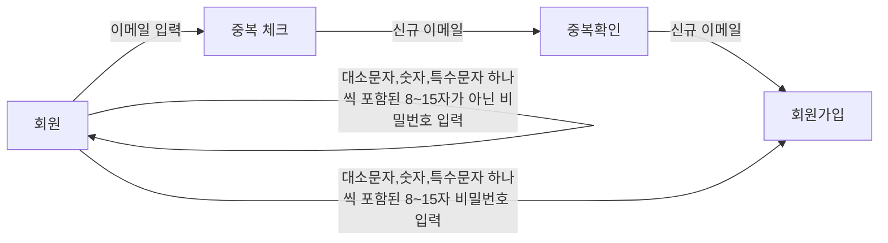
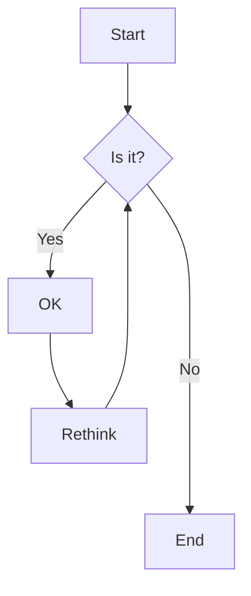
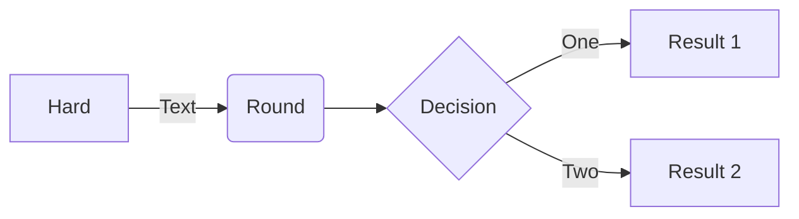
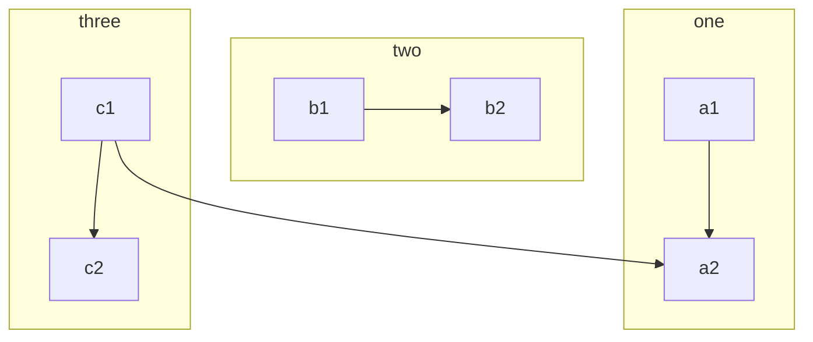
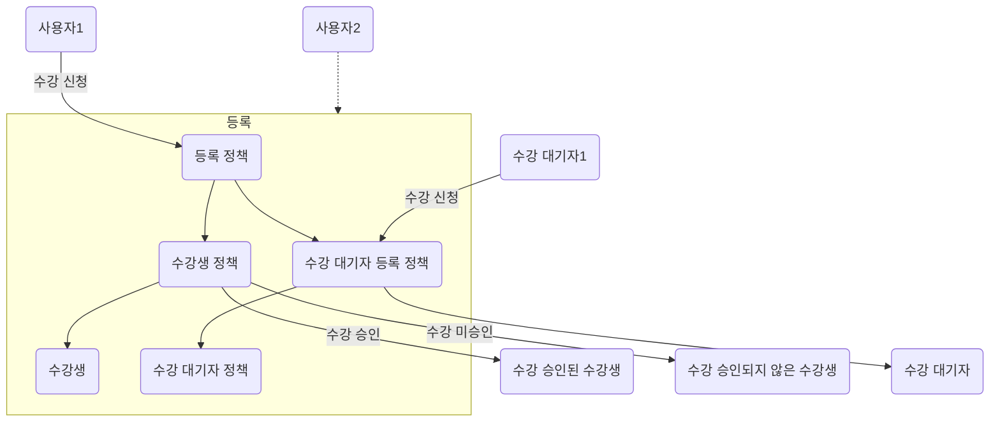
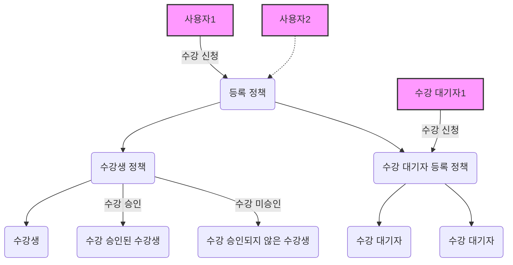
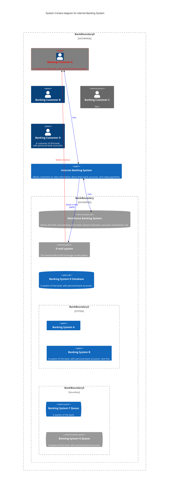

# spring-shopping-precourse

## 사용자 스토리

- 사용자는 상품을 (상점에) 추가할 수 있다.
- 사용자는 (상정의) 상품을 수정할 수 있다.
- 상품은 잘못된 이름을 가져서는 안 된다.
    - 상품은 최대 15자를 넘는 이름을 가져서는 안 된다.
    - 상품은 일부 특수 문자를 허용하지 않는다.
    - 상품은 일부 특수 문자는 허용한다.
    - 상품은 비속어를 포함하지 않는다.

---

- 상품은 최대 15자를 넘는 이름을 가져서는 안 된다.
    - [x] 동해물과백두산이마르고닳도록
    - [ ] 동해물과 백두산이 마르고 닳도록

```gherkin
Given 상품 이름이 "동해물과 백두산이 마르고 닳도록"일 때
When 상품을 생성하면
Then 400 Bad Request를 응답한다.
AND "상품의 이름은 15자를 넘길 수 있습니다."라고 응답한다.
```

```gherkin
Given 기존 상품이 존재할 때
And 변경하고자 하는 상품 이름이 "동해물과 백두산이 마르고 닳도록"
When 상품을 수정하면
Then 400 Bad Request를 응답한다
And "상품의 이름은 15자를 넘길 수 없습니다."라고 응답한다.
```

상품은 일부 특수 문자는 허용하지 않는다.

- [ ] (할인) 아메리카노
- [ ] 아메리카노 *할인
- [ ] ...

# 용어 사전

| 한글명     | 영문명              | 설명                                                    |
|---------|------------------|-------------------------------------------------------|
| 판매자     | Seller           | 상품을 관리(등록, 수정, 삭제)하며 판매하는 주체                          |
| 구매자     | Buyer            | 상품을 구매하는 주체이며 위시 리스트를 추가, 삭제하는 주체                     |
| 관리자     | Admin            | 쇼핑시스템을 전반적으로 관리할 수 있는 권한을 가진 주체                       |
| 비속어     | Slang            | PurgoMalum에서 비속어로 규정한 단어                              |
| 토 큰     | Token            | 인증인가된 사용자를 식별 할 수 있는 값                                |
| 이벤트     | Event            | 한명 또는 복수의 Actor에게 영향을 끼치는 사건                          |
| 위시리스트   | WishList         | 구매자가 자신의 마음에 드는 삼품을 저장해서 만드는 리스트, 이 리스트를 사용해서 구매는 불가능 |
| 비밀번호 찾기 | Find my password | 판매자 혹은 구매자가 비밀번호를 잊어버렸거나 재발급을 원할 때 재발급 하는 기능          |
| 클라이언트   | Client           | 쇼핑 시스템을 이용하는 모든 사람                                    |

# 모델링

+ `Product`는 중복되지 않는 `Id`를 가진다.
+ `Product`는 `Name`을 가진다.
+ `Product`는 `Price`를 가진다.
+ `Product`는 `ImageUrl`를 가진다.
+ `Name`은 공백을 포함한 최대 15자 길이의 이름을 가진다.
+ `Name`은 다음 특수문자를 허용한다. ( ), [ ], +, -, &, /, _
+ `Name`은 비속어를 포함할 수 없다.
+ `SlangFilterClient`는 문자열에 비속어가 포함되어 있는지를 확인한다.
+ `Price`는 유리수이다.
+ `ImageUrl`은 `URI`을 가진다.
+ `ImageUrl`은 .png, .jpg 확장자여야 한다.
+ `User`은 `Role`을 가진다.
+ `User`은 `Email`을 가진다.
+ `User`은 `Password`을 가진다.
+ `Role`은 `Seller`, `Buyer`, `Admin`을 값으로 가진다.
+ `Wishlist`는 중복되지 않는 `Id`를 가진다.
+ `Wishlist`는 `User`, `Product`을 가진다.
+ `Role`이 `Seller`인 `User`는 `Product`를 생성한다.
+ `Role`이 `Seller`인 `User`는 `Product`를 수정한다.
+ `Role`이 `Seller`인 `User`는 `Product`를 삭제한다.
+ `Role`이 `Buyer`인 `User`는 `Wishlist`를 생성한다.
+ `Role`이 `Buyer`인 `User`는 `Wishlist`를 삭제한다.
+ `TokenGenerator`는 `Token`을 생성한다.
+ `HashStatistics`는 문자열을 단방향 암호화 한다.
+ `HashStatistics`는 원본 문자열과 암호화된 문자열이 일치하는지 확인한다.
+ `EncryptStatistics`는 원본 문자열을 암호화 한다.
+ `EncryptStatistics`는 암호화된 문자열을 복호화 한다.

## 이벤트

## 정책













